
<h1 style="font-family: courier;" align="center">satshakit-grbl</h1>

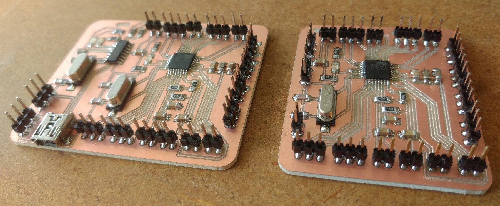

<i>An open source & fabbable GRBL controller board.</i>

satshakit-grbl
--
satshakit-grbl is a microcontroller board designed to work with **[grbl](https://github.com/gnea/grbl/wiki)** that you can make in any Fab Lab. This board comes in two different versions, **serial** having integrated an usb port and a serial converter, and **noserial** for a bare metal grbl board. In both cases these boards will allow you to easily make your own machine controller for any kind of machine supported by grbl.

Here the **features** of the satshakit-grbl:

- **Atmega328p** for maximum compatibility with grbl
- **CH340G** and **USB** (serial version)
- **USB programming** and **serial communication** (serial version)
- **endstop noise filtering**
- logically disposed **grbl pinout**
- 2.54mm pitch **wire to board connectors** compatibility
- **multiple GNDs and VCCs** to connect all the required drivers/switches
- cost of about **4€** (serial version)

Here are the schematic and the board of the **serial** version:
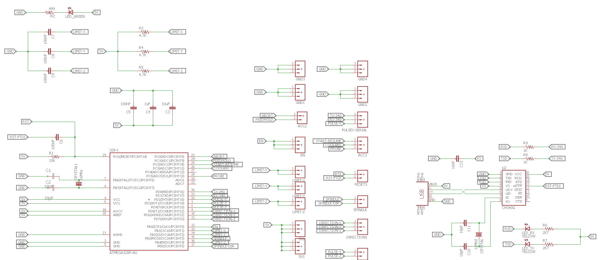
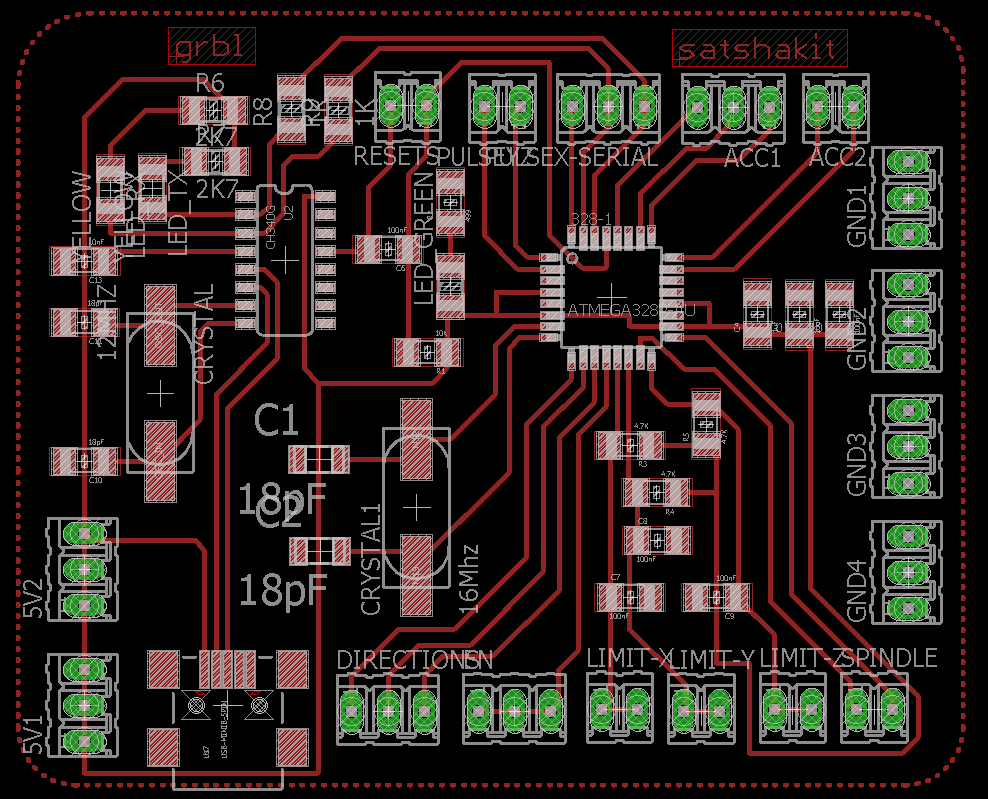

And here the schematic and the board of the **noserial** version:

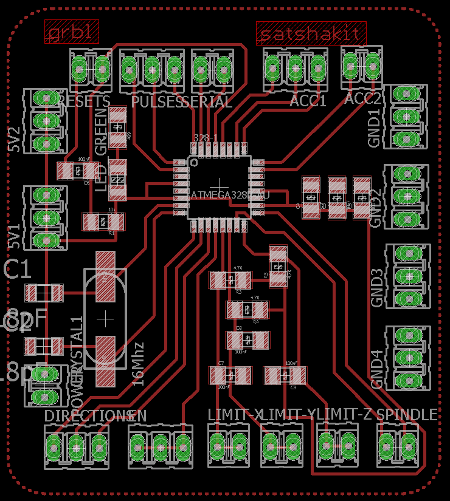

downloads
--

- **[satshakit-grbl serial schematic](https://github.com/satshakit/satshakit-grbl/raw/master/eagle/serial/satshakit-grbl.sch)**
- **[satshakit-grbl serial board](https://github.com/satshakit/satshakit-grbl/raw/master/eagle/serial/satshakit-grbl.brd)**
- **[satshakit-grbl serial internal png](https://github.com/satshakit/satshakit-grbl/raw/master/media/internal_s.png)**
- **[satshakit-grbl serial external png](https://github.com/satshakit/satshakit-grbl/raw/master/media/external_s.png)**

- **[satshakit-grbl noserial schematic](https://github.com/satshakit/satshakit-grbl/raw/master/eagle/no_serial/satshakit-grbl.sch)**
- **[satshakit-grbl noserial board](https://github.com/satshakit/satshakit-grbl/raw/master/eagle/no_serial/satshakit-grbl.brd)**
- **[satshakit-grbl noserial internal png](https://github.com/satshakit/satshakit-grbl/raw/master/media/internal_ns.png)**
- **[satshakit-grbl noserial external png](https://github.com/satshakit/satshakit-grbl/raw/master/media/external_ns.png)**

- **[satshakit-grbl BOM xlsx](https://github.com/satshakit/satshakit-grbl/raw/master/bom/satshakit-grbl-bom.xlsx)**
- **[satshakit-grbl BOM ods](https://github.com/satshakit/satshakit-grbl/raw/master/bom/satshakit-grbl-bom.ods)**

getting started
--

Before using a satshakit-grbl board on your machine, it is necessary to **upload the grbl**. In both version is recommeded to first upload the **Arduino bootloader** using an ISP programmer. Here is an example using **[Arduino as ISP](https://www.arduino.cc/en/Tutorial/ArduinoISP)** for both versions. More info are available in the **[satshakit repository](https://github.com/satshakit/satshakit)**.

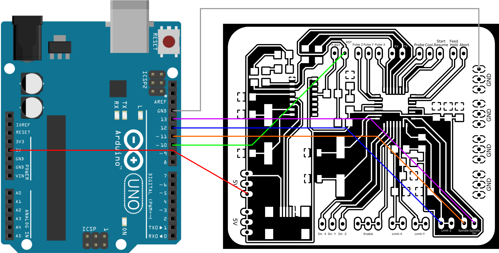
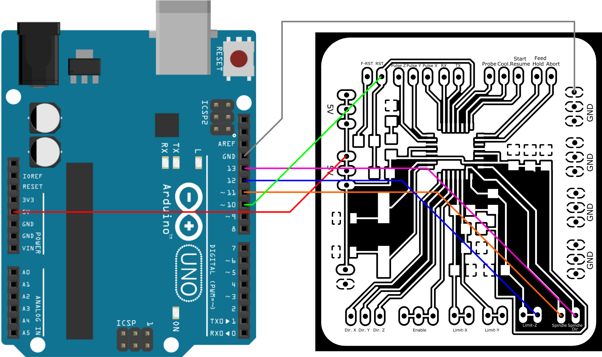

After having uploaded the Arduino bootloader, it is possible to directly upload the grbl using a **mini USB cable** for the **serial version**, or an **FTDI cable** for the **noserial** version. Find here a schema on how to connect the noserial version with an FTDI cable:

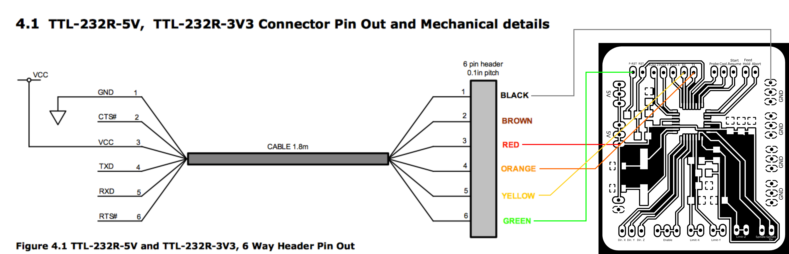

Finally, to **connect your satshakit-grbl to your machine**, here the **pinouts** of both versions:

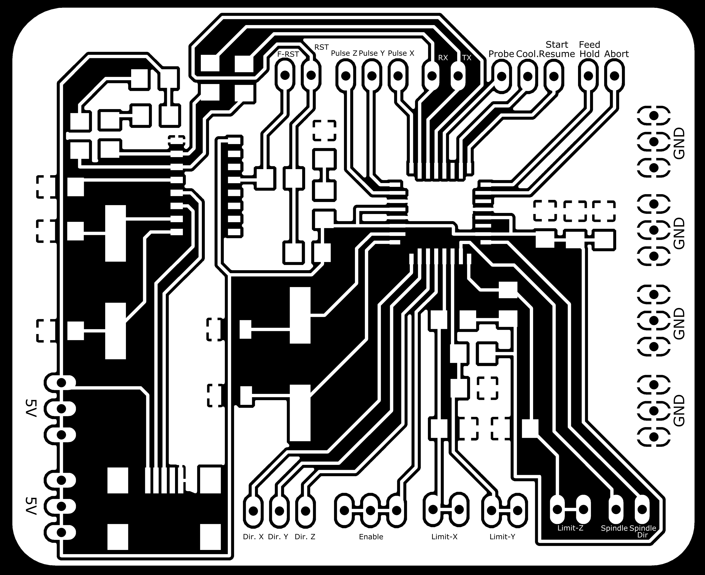

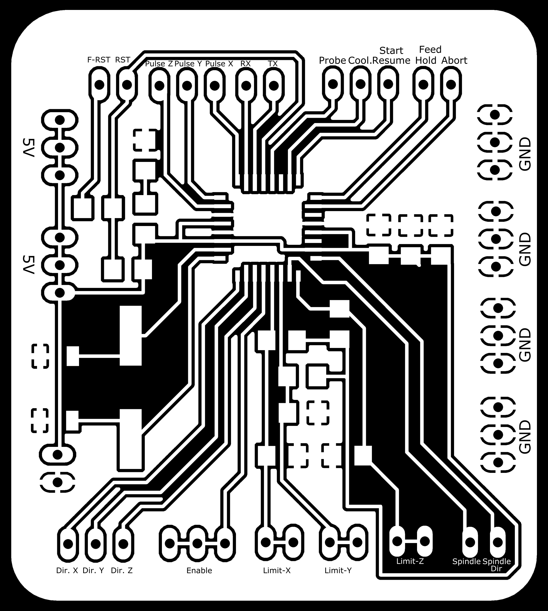

media
--

**images:**

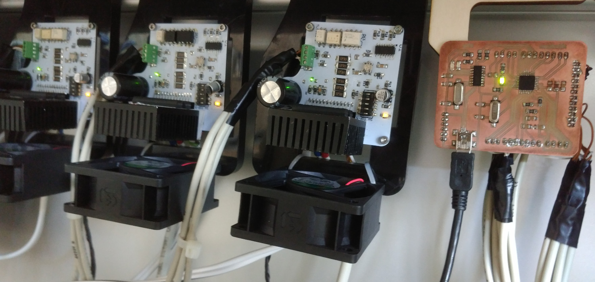
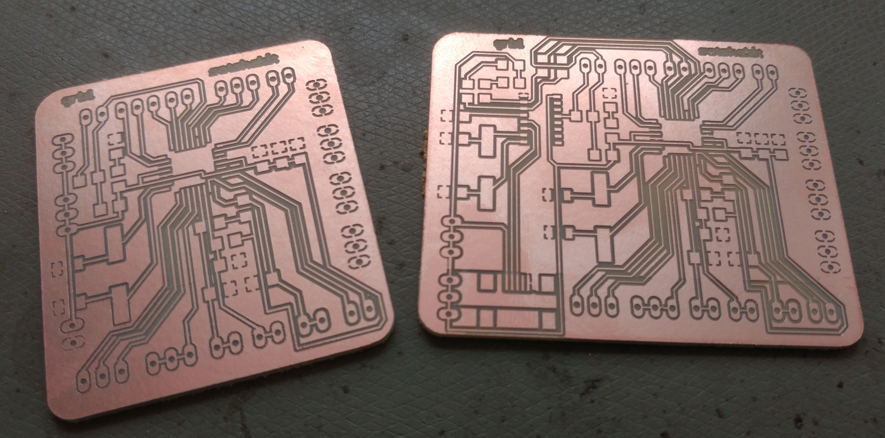
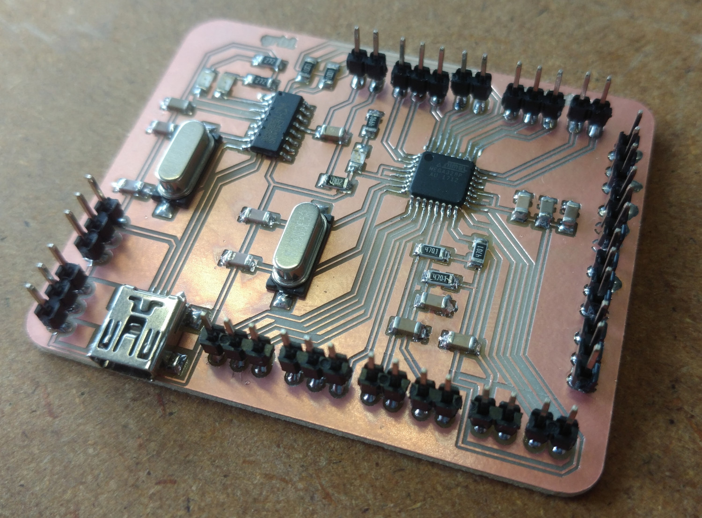

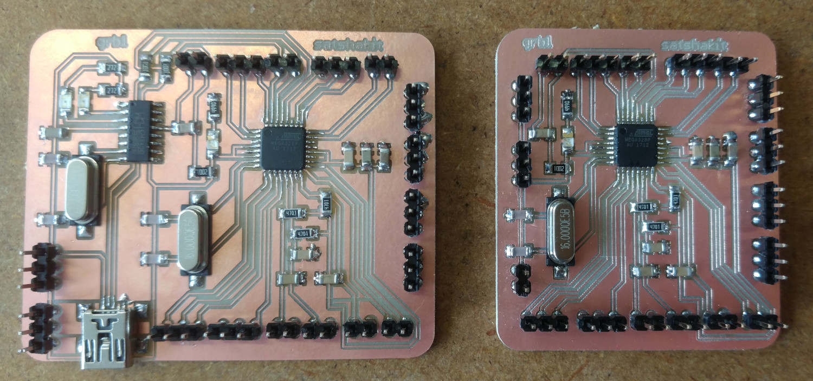

**videos:**

License
--
This work is licensed under the terms of the open source license: Creative Commons Attribution-ShareAlike 4.0 International ([CC BY-SA 4.0](https://creativecommons.org/licenses/by-sa/4.0/)).

Disclaimer  
--

This hardware/software is provided "as is", and you use the hardware/software at your own risk. Under no circumstances shall any author be liable for direct, indirect, special, incidental, or consequential damages resulting from the use, misuse, or inability to use this hardware/software, even if the authors have been advised of the possibility of such damages.
